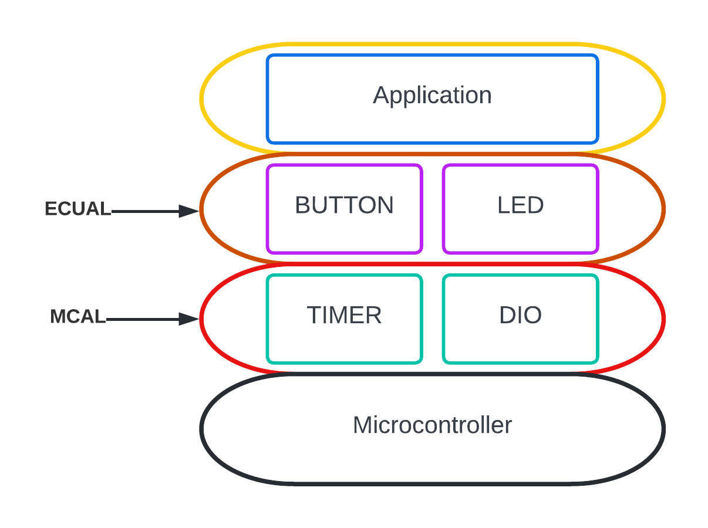

# On-demond Traffic Light Control
## 1. System Description
### 1.1. Introduction
Traffic lights are signaling devices positioned at road intersections, pedestrian crossings, and other locations to control the flow of traffic.

Traffic lights normally consist of three signals, transmitting meaning to drivers and riders through colors and symbols including arrows and bicycles.

The regular traffic light colors are red, yellow, and green arranged vertically or horizontally in that order.

Although this is internationally standardized, variations exist on national and local scales as to traffic light sequences and laws.

In our system, we will implement a traffic lights system with an on-demand crosswalk button.

Crosswalk buttons let the signal operations know that someone is planning to cross the street, so the light adjusts, giving the pedestrian enough time to get across.

### 1.2. System Modes
In our system there are two modes; normal mode and pedestrian mode.
#### 1.2.1 Normal Mode
Cars' traffic lights will be changed every five seconds starting from Green then yellow then red then yellow then Green. The Yellow LED will blink for five seconds before moving to Green or Red LEDs.

#### 1.2.2 Pedestrian Mode
The system changes from normal mode to pedestrian mode when the pedestrian button is pressed.

If pressed when the cars' Red LED is on, the pedestrian's Green LED and the cars' Red LEDs will be on for five seconds, this means that pedestrians can cross the street while the pedestrian's Green LED is on.

If pressed when the cars' Green LED is on or the cars' Yellow LED is blinking, the pedestrian Red LED will be on then both Yellow LEDs start to blink for five seconds, then the cars' Red LED and pedestrian Green LEDs are on for five seconds, this means that pedestrian must wait until the Green LED is on.

At the end of the two states, the cars' Red LED will be off and both Yellow LEDs start blinking for 5 seconds and the pedestrian's Green LED is still on.

After the five seconds the pedestrian Green LED will be off and both the pedestrian Red LED and the cars' Green LED will be on. Traffic lights signals are going to the normal mode again.

## 2. System Design

### 2.1. Button Driver
#### 2.1.1 API Specification
##### 2.1.1.1 Type Definitions
##### 2.1.1.2 Function Definitions
### 2.2. LED Driver
#### 2.2.1 API Specification
##### 2.2.1.1 Type Definitions
##### 2.2.1.2 Function Definitions
### 2.3. DIO drivers
#### 2.3.1 API Specification
##### 2.3.1.1 Type Definitions
##### 2.3.1.2 Function Definitions
### 2.4. Timer driver
#### 2.4.1 API Specification
##### 2.4.1.1 Type Definitions
##### 2.4.1.2 Function Definitions
